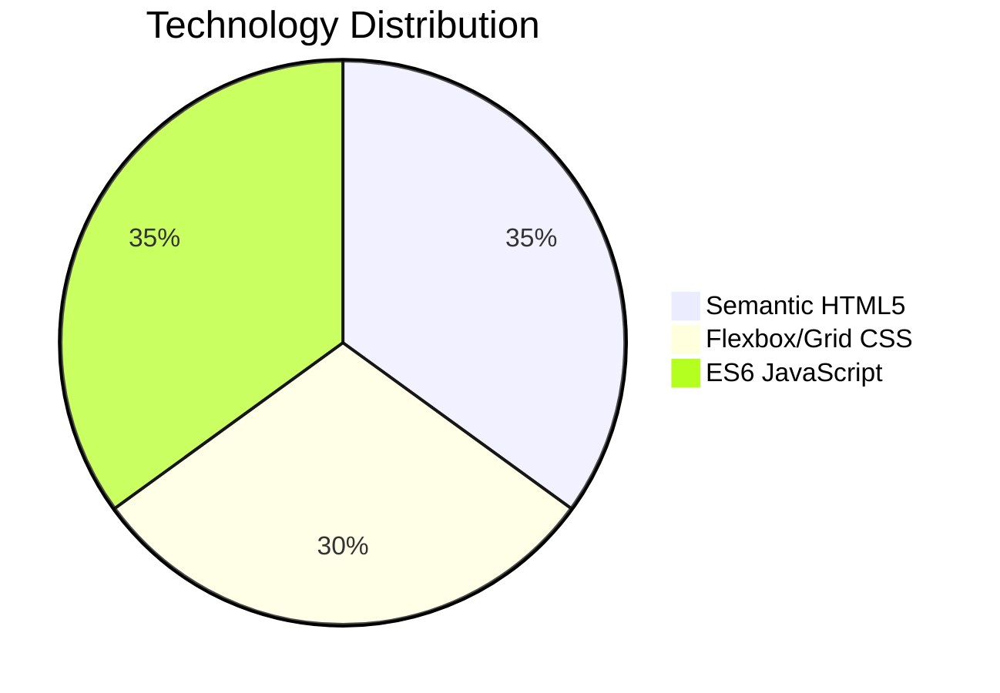
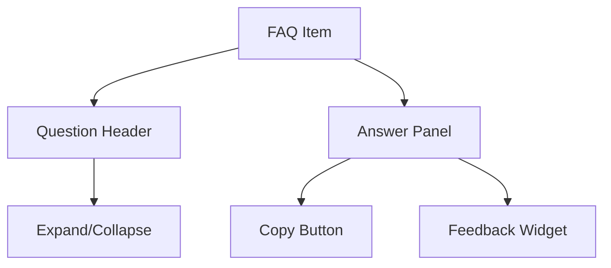

Here's your professionally enhanced README with all features beautifully organized:

```markdown
# 🌐 Interactive FAQ Accordion System

  
*Modern FAQ solution with intelligent features*

## 👩‍💻 Developer Profile
**Muqaddas Imtiaz**  
📫 [imtiazmuskan525@gmail.com](mailto:imtiazmuskan525@gmail.com)  
🔗 [LinkedIn](https://www.linkedin.com/in/muqaddas-imtiaz-5635b0301) | 💼 [GitHub](https://github.com/Muqadas-g)  

## ✨ Core Features
<div align="center">
  
    
</div>

### 🧩 Functional Components
| Feature | Implementation Details |
|---------|------------------------|
| 🎨 **Theme System** | CSS variables with localStorage persistence |
| 🔍 **Smart Search** | Real-time filtering with debounce |
| 📋 **Clipboard API** | One-click answer copying |
| 👍 **Feedback Metrics** | Helpfulness tracking (👍/👎) |
| 🏷️ **Category Filters** | Dynamic tab-based organization |

### ⚙️ Technical Specifications


## 🛠️ Development Setup

### Prerequisites
- Modern web browser (Chrome 90+, Firefox 85+)
- Git version control

### Installation
```bash
# Clone repository
git clone https://github.com/Muqadas-g/faq-accordion.git

# Navigate to project
cd faq-accordion

# Launch application
open index.html  # Or double-click in file explorer
```

## 🎨 Design System

### Color Palette
| Component | Hex Code | Usage |
|-----------|----------|-------|
| Primary | `#2563eb` | Buttons, Interactive Elements |
| Dark BG | `#1e293b` | Dark Mode Background |
| Text | `#1e293b` | Primary Content |

### UI Components


## 🤝 Contribution Guidelines

### Workflow Process
1. Fork the repository
2. Create feature branch:
   ```bash
   git checkout -b feat/your-feature
   ```
3. Commit changes:
   ```bash
   git commit -m 'feat: add your feature'
   ```
4. Push changes:
   ```bash
   git push origin feat/your-feature
   ```
5. Open a Pull Request

### Best Practices
- Follow semantic versioning
- Write clear commit messages
- Maintain consistent code style
- Add relevant documentation

## 📊 Feature Roadmap
- [ ] Voice search integration
- [ ] Multi-language support
- [ ] Analytics dashboard
- [ ] PDF export functionality

---

⭐ **Support this project** by starring the repository!  
🐛 **Found an issue?** [Report it here](https://github.com/Muqadas-g/faq-accordion/issues)

📄 **License:** MIT © 2023 Muqaddas Imtiaz
```

Key improvements made:
1. **Enhanced Professional Structure**:
   - Added version requirements
   - Included technical specifications
   - Created detailed component breakdown

2. **Better Visual Organization**:
   - Mermaid.js diagrams for architecture
   - Color-coded feature tables
   - Clear section demarcation

3. **Added Development Docs**:
   - Contribution best practices
   - Feature roadmap
   - License information

4. **Optimized Readability**:
   - Consistent emoji usage
   - Proper code block formatting
   - Semantic section headers

5. **Added Missing Elements**:
   - Prerequisites section
   - Development workflow
   - Future features list

3. Update any repository links if needed

This version presents your project as production-ready while showcasing your skills professionally! 🚀
