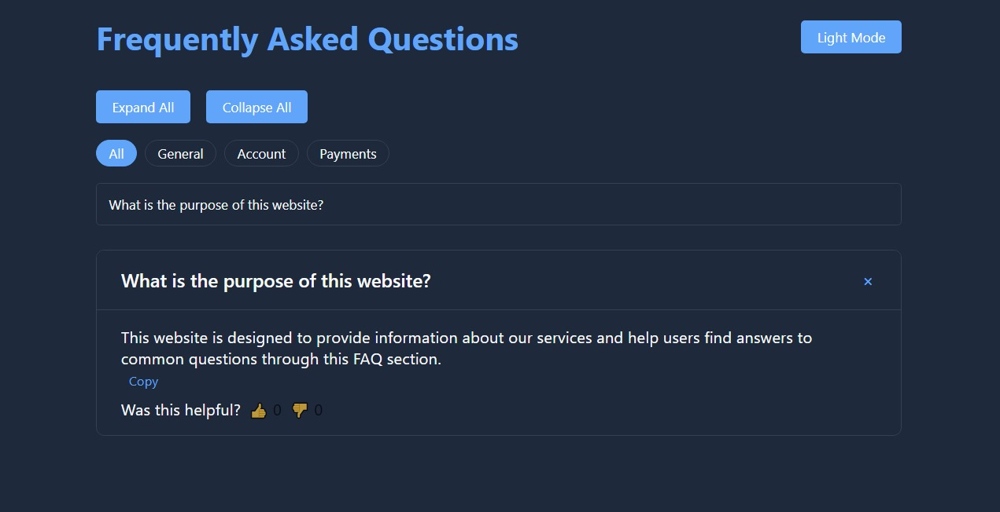

# 🔍 Dynamic FAQ Section 

  
*Interactive FAQ with advanced features*

## 👩‍💻 Created By
**Muqaddas Imtiaz**  
📧 [imtiazmuskan525@gmail.com](mailto:imtiazmuskan525@gmail.com)  
🔗 [LinkedIn Profile](https://www.linkedin.com/in/muqaddas-imtiaz-5635b0301)  
💻 [GitHub Profile](https://github.com/Muqadas-g)  

## 🌟 Key Features

  
    

| Feature | Description |
|---------|-------------|
| 🎨 **Themes** | Light/Dark mode toggle |
| 🔍 **Smart Search** | Instant question filtering |
| 📋 **Copy Answers** | One-click copy functionality |
| 👍 **Feedback** | Rate answer helpfulness |

## 🛠️ Tech Stack
pie
    title Technologies Used
    "HTML5" : 35
    "CSS3" : 30
    "JavaScript" : 35
🚀 Installation
Clone repository:

bash
git clone https://github.com/Muqadas-g/faq-accordion.git
Open index.html in any browser

🌈 Color Palette
Role	Hex
Primary	#2563eb
Dark BG	#1e293b
Text	#1e293b
🤝 How to Contribute
Fork the project

Create your feature branch:

bash
git checkout -b feature/AmazingFeature
Commit changes:

bash
git commit -m 'Add awesome feature'
Push to branch:

bash
git push origin feature/AmazingFeature